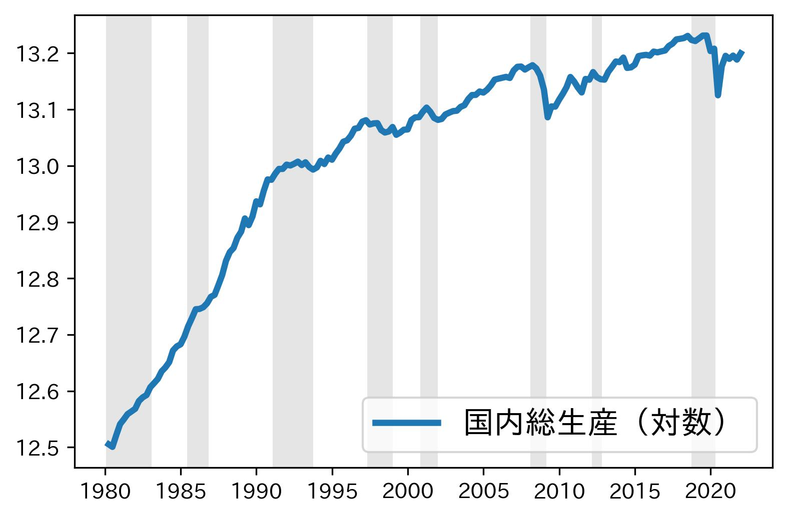

[](https://pypi.python.org/pypi/py4macro/)

[](https://github.com/Py4Macro/py4macro/actions?query=workflow%codeql-analysis)


# はじめに

[Pythonで学ぶマクロ経済学 (中級＋レベル)](https://py4macro.github.io)で使うモジュール。

以下が含まれている。
* Hodrick-Prescottフィルターを使い時系列データのトレンドを返す`trend()`関数
* DataFrameを全て表示する`show()`関数
* `n`個の浮動小数点数から構成されるリストを返す`xvalues()`関数
* 後退期間にグレーの塗りつぶしを追加する`fukyo()`関数
* 後退期間にグレーの塗りつぶしを追加する`recessions()`デコレーター
* データ・セット
    * Penn World Tables 10.01
    * IMF World Economic Outlook 2021
    * Maddison Project Database 2020
    * 日本の四半期データ（GDPなど）
    * 日本の四半期データ（マネーストックなど）
    * 177ヵ国のマネーストックなど
    * 円/ドル為替レートなど
    * 景気循環日付と拡張・後退期間
    * Big Macインデックス

# 使い方
```
import py4macro
```

## Hodrick-Prescottフィルターによるトレンド抽出
```
py4macro.trend(s,lamb=1600)
```
**引数**:

* `s`：`Series`もしくは１列の`DataFrame`とし，行のラベルは`DatetimeIndex`にすること。
* lamb: HPフィルターのlambda（デフォルトは四半期用のデータでは通常の値である1600としている）

**戻り値**:

Hodrick-Prescottフィルターで計算したtrend（トレンド）の`Series`


**例**:

`py4macro.trend(df.loc[:,'gdp'])`


## `DataFrame`の行・列を全て表示する
```
py4macro.show(df)
```
**引数**：
* `df`：`DataFrame`

**戻り値**：

`DataFrame`の表示のみ


## `n`個の数値から構成されるリストを作成する
```
py4macro.xvalues(l, h, n)
```
**引数**：
* `l`：最小値
* `h`：最大値
* `n`：要素数

**戻り値**：

`n`個の浮動小数点数のリスト

**例**:

`py4macro.xvalues(-1, 1, 5)`

```
>>> [-1.0, -0.5, 0.0, 0.5, 1.0]
```


## 横軸に`DatetimeIndex`を使うプロットに対して後退期間にグレーの塗りつぶしを追加する関数
* `fukyo()`関数は後退期間の塗りつぶしを追加する

```
py4macro.fukyo(ax, color='k', alpha='0.1')
```
**引数**：
* `ax`：`matplotlib`の軸
* `color`：色（デフォルトは黒）
* `alpha`：透明度（デフォルトは`0.1`）

**戻り値**：
* なし（表示のみ）




＜例１：一つの図＞
```
fig, ax = plt.subplots()
ax.plot(...)
fukyo(ax)
```

＜例２：一つの図＞
```
ax = <DataFrame もしくは Series>.plot()
fukyo(ax, color='red')
```

＜例３：複数の図の中で一つだけに追加＞
```
fig, ax = plt.subplots(2,1)
ax[0].plot(...)
ax[1].plot(...)
fukyo(ax[0], color='grey', alpha=0.2)
```


## 横軸に`DatetimeIndex`を使うプロットに対して後退期間にグレーの塗りつぶしを追加するデコレーター
* `@py4macro.recessions()`は全ての軸に後退期間の塗りつぶしを追加する

```
@py4macro.recessions(color='k', alpha=0.1)
＜関数＞
```

**引数**：
* `color`：色（デフォルトは黒）
* `alpha`：透明度（デフォルトは`0.1）


＜例１：一つの図をプロット（軸を返さない）＞
```
@py4macro.recessions()
def plot():
    <DataFrame もしくは Series>.plot()
```

＜例２：一つの図をプロット（軸を返す）＞
```
@py4macro.recessions(color='red')
def plot():
    ax = <DataFrame もしくは Series>.plot()
    return ax
```

＜例３：一つの図をプロット＞
```
@py4macro.recessions(alpha=0.9)
def plot():
    fig, ax = plt.subplots()
    ax.plot(...)
    return ax       # 省略すると軸を返さない
```

＜例４：複数の図をプロット＞
```
@py4macro.recessions(color='green', alpha=0.2)
def plot():
    ax = <DataFrame>.plot(subplots=True, layout=(2,2))
    return ax       # この行は必須
```

＜例５：複数の図をプロット＞
```
@py4macro.recessions(color='grey', alpha=0.3)
def plot():
    fig, ax = plt.subplots(2, 1)
    ax[0].plot(...)
    ax[1].plot(...)
    return ax       # この行は必須
```


## データ・セット

```
py4macro.data(dataset=None, description=0)
```

**引数**：

* `dataset`: (文字列)
    * `'pwt'`:   Penn World Table 10.0
    * `'weo'`:   IMF World Economic Outlook 2021
    * `'mad'`:   country data of Maddison Project Database 2020
    * `'mad-regions'`:   regional data of Maddison Project Database 2020
    * `'jpn-q'`: 日本の四半期データ（GDPなど）
    * `'jpn-money'`: 日本の月次データ（CPIとマネーストック）
    * `'world-money'`: 177ヵ国のマネーストックなど
    * `'ex'`: 円/ドル為替レートなど
    * `'bigmac'`: Big Macインデックス


* `description` (デフォルト：`0`, 整数型):
    * `0`: データのDataFrameを返す
        * 全てのデータセット
    * `1`: 変数の定義を全て表示する
        * 全てのデータセット
    * `2`: 変数の定義のDataFrameを返す
        * `'pwt'`，`'weo'``'mad'`のみ
    * `-1`: 何年以降から予測値なのかを全て示す
        * `'weo'`のみ
    * `-2`: 何年以降から予測値なのかを示すDataFrameを返す
        * `'weo'`のみ

**返り値**：
    `DataFrame`もしくは`DataFrame`の表示


例１：IMF World Economic OutlookのDataFrameを返す

`py4macro.data('weo')`

例２：IMF World Economic Outlookの変数定義の全てを表示する

`py4macro.data('weo',description=1)`

例３：IMF World Economic Outlookの変数定義のDataFrameを返す

`py4macro.data('weo',description=2)`

例４：IMF World Economic Outlookの変数の推定値の開始年を全て表示する

`py4macro.data('weo',description=-1)`

例５：IMF World Economic Outlookの変数の推定値の開始年のDataFrameを返す

`py4macro.data('weo',description=-2)`


# インストール方法
```
pip install py4macro
```
or
```
pip install git+https://github.com/Py4Macro/py4macro.git
```
or
```
git clone https://github.com/Py4Macro/py4macro.git
cd py4macro
pip install .
```
